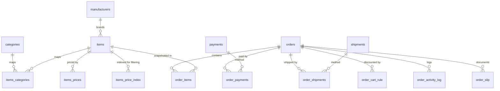

# Database Schema

Alfa Commerce uses 60+ MySQL tables, all prefixed `#__alfa_`. This page is the **map** — the entities, how they relate,
and the special mechanisms. For the exhaustive column-level definition, the source of truth is the install file:

> 📄 **Full DDL:** [`administrator/sql/install.mysql.utf8.sql`](https://github.com/Easylogic-CO-LP/Alfa-Commerce/blob/main/administrator/sql/install.mysql.utf8.sql)

:::note Translatable fields live elsewhere
Columns like `name`, `alias`, descriptions and meta are **not** on the tables below — they live in per-language
auxiliary tables `#__alfa_<entity>_<langtag>`. See [Multilingual & Translations](./multilingual.md).
:::

## Core relationships



## Catalog

| Table | Purpose |
|-------|---------|
| `#__alfa_items` | Product master (SKU, stock, dimensions, weight) |
| `#__alfa_categories` | Hierarchical categories |
| `#__alfa_items_categories` | Items ↔ categories (M:N) |
| `#__alfa_manufacturers` | Brands / manufacturers |
| `#__alfa_items_prices` | Prices by currency / user group / location / quantity tier |
| `#__alfa_items_price_index` | Denormalized price index for fast filtering ([see below](#price-index)) |

## Pricing rules

| Table | Purpose |
|-------|---------|
| `#__alfa_discounts` (+ `_categories` / `_usergroups` / `_places`) | Discount rules + their category / group / location scope |
| `#__alfa_taxes` (+ `_categories` / `_usergroups` / `_places`) | Tax rates + their scope |
| `#__alfa_coupons` (+ `_usergroups` / `_users`) | Coupon codes + visibility / assignment |

## Cart & checkout

| Table | Purpose |
|-------|---------|
| `#__alfa_cart` | Cart header (user, selected payment / shipment) |
| `#__alfa_cart_items` | Cart lines (item, quantity) |
| `#__alfa_user_info` | Delivery & invoice addresses |

## Orders

| Table | Purpose |
|-------|---------|
| `#__alfa_orders` | Order header (customer, status, methods — totals are computed, not stored) |
| `#__alfa_order_items` | Line items with a pricing snapshot |
| `#__alfa_order_payments` | Payment records (status, gateway data, refunds) |
| `#__alfa_order_shipments` | Shipment records (status, tracking) |
| `#__alfa_order_detail_tax` | Per-item tax breakdown |
| `#__alfa_order_cart_rule` | Applied discounts / coupons per order |
| `#__alfa_order_activity_log` | Unified audit log (status changes, actions) |
| `#__alfa_order_slip` (+ `_detail`) | Invoice / packing-slip snapshots |
| `#__alfa_orders_statuses` | Order status definitions |
| `#__alfa_orderstatus_recipients` | Admin recipients for status emails |

## Configuration

| Table | Purpose |
|-------|---------|
| `#__alfa_payments` | Payment **method** records (each points at a plugin) |
| `#__alfa_shipments` | Shipping **method** records |
| `#__alfa_currencies` | Currencies (200+ pre-loaded) |
| `#__alfa_places` | Countries / locations |
| `#__alfa_form_fields` (+ `_form_field_groups` / `_form_fields_usergroups` / `_form_fields_users`) | Form-field definitions + scope |
| `#__alfa_customs` | Form-field entries (submitted values) |

## Users

| Table | Purpose |
|-------|---------|
| `#__alfa_users` | Customer profiles (with B2B fields) |
| `#__alfa_usergroups` | Customer segments (per-group price visibility = JSON in `prices_display`) |
| `#__alfa_categories_usergroups` / `_users` | Category visibility per group / per user |

## System

| Table | Purpose |
|-------|---------|
| `#__alfa_media` | Product / category / manufacturer images (path, dominant colour) |
| `#__alfa_notifications` | Backend [notification centre](../helpers/notifications.md) store |
| `#__alfa_<plugin>_logs` | Per-plugin log tables (auto-created from each plugin's `logs.xml`) |

## Price index

`#__alfa_items_price_index` is a denormalized index maintained by `PriceIndexSyncService` — it pre-computes prices for
every (currency, location, user group) combination so the catalog can filter by price in SQL. Columns: `base_price`,
`discount_amount`, `base_price_with_discounts`, `tax_amount`, `base_price_with_tax` (the "was" price), `final_price`
(the primary filter column), `discount_percent`. Synced on item save and discount/tax change — see
[Pricing](../helpers/pricing.md).

## Migrations

Schema migrations live in `administrator/sql/updates/mysql/`, named by version (e.g. `1.0.9.sql`). On update, Joomla
runs every file newer than the installed schema automatically.

### Removing obsolete files

SQL migrations only add or alter tables — **files** a release no longer ships are removed by a parallel, version-keyed
mechanism. List the old paths in `administrator/files/removed/<version>.json`:

```json
{
  "files":   ["/components/com_alfa/old-controller.php"],
  "folders": ["/media/com_alfa/js/legacy"]
}
```

Paths are relative to the Joomla root. On update, `script.php` applies every list newer than the installed version (so a
site that skipped releases is still fully cleaned up). Joomla never removes files dropped between versions on its own, so
add this list whenever you delete or rename a shipped file.
