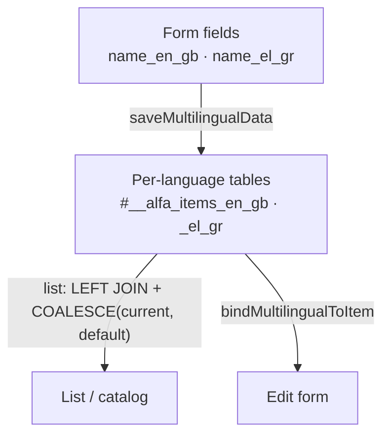

# Multilingual & Translations

Alfa Commerce stores translatable content (product names, aliases, descriptions, meta) in **per-language
auxiliary tables**, not in the main entity table.

## Data model

For every translatable entity there is one aux table **per installed content language**, named
`#__alfa_<entity>_<langtag>`, sharing the parent's id:

```
#__alfa_items            (structural columns only: id, sku, stock, prices…)
#__alfa_items_en_gb      (id_item, name, alias, short_desc, meta_title, …)
#__alfa_items_el_gr      (id_item, name, alias, short_desc, meta_title, …)
```

The main table keeps only non-translatable columns. (Joomla's `Table::bind()` ignores keys with no matching
column, so passing translatable keys in the main `$data` is harmless.) These tables are **created
automatically** — lazily on first save, or up-front by `ensureLangSchema()` (the installer and the admin
**Resync languages** tool call it; the [`system/alfasync`](#kept-in-sync) plugin calls it when you add a new
content language).

## How a translatable field flows




- **Form fields** use the `fieldName_langCode` convention (`name_en_gb`, `alias_el_gr`, …) — generated by the
  `MultilingualText` field type.
- **Save** → `MultilingualHelper::saveMultilingualData()` splits the flat keys per language and upserts a row
  into each `#__alfa_<entity>_<langtag>` table inside one transaction (missing tables/columns are created on the fly).
- **Read into the edit form** → `bindMultilingualToItem($item, $id, $primaryColumn, $table)` in the model's `getItem()`.
- **List queries** → `addMultilingualJoinToQuery()` LEFT-JOINs the current (and default) language table and selects
  each field via `COALESCE(NULLIF(current), NULLIF(default), '')` — records without a translation still appear, and
  the value is read only from language tables.
- **Related entities** → `addRelatedIdsToQuery()` adds correlated `GROUP_CONCAT` subqueries (no outer `GROUP BY`, so
  pagination totals stay correct), then `loadRelated()` batch-loads the translated related records after pagination.

## Aliases

The **alias is fully translatable** — each language keeps its own URL slug in its language table, and there is
**no alias column on the main table** (and no fallback to it). Blank aliases are generated from the name, sanitised,
and made **unique per language**, appending `-2`, `-3`, … on collision. Uniqueness scope is configurable
(`aliasUniqueScope`): e.g. a category alias is unique within its `parent_id`, while an item alias is globally unique
(items belong to many categories and need an unambiguous site-wide slug).

For language-switch / association links, `getTranslatedValue($id, $table, $primaryColumn, 'alias', $langTag)` returns
a single field in a specific language, so a `&lang=xx` URL emits that language's alias.

## Kept in sync

The [`system/alfasync`](#) plugin is the runtime bridge that mirrors Joomla users/usergroups into the Alfa shadow
tables and, on adding a new content language, runs `ensureLangSchema()` so the new `#__alfa_<entity>_<langtag>`
tables exist immediately. **Keep it enabled** — without it, a newly added language has nowhere to store its
translations, and new/edited Joomla users won't be mirrored into `#__alfa_users`.

> Reference: `administrator/src/Helper/MultilingualHelper.php`.
