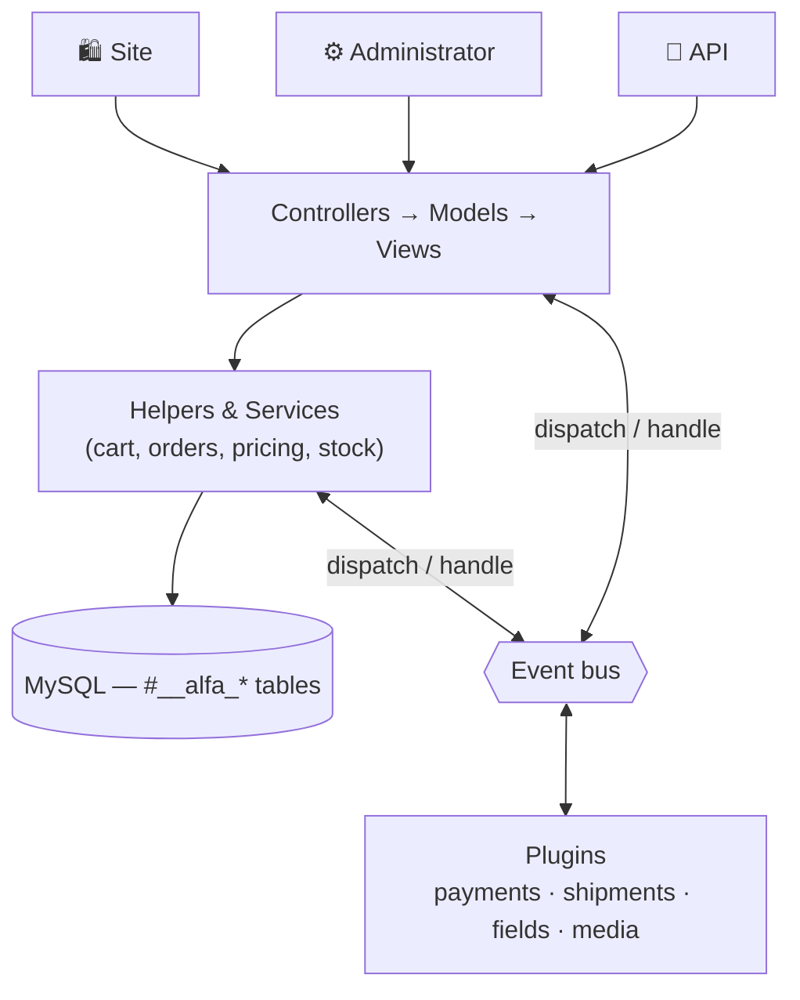
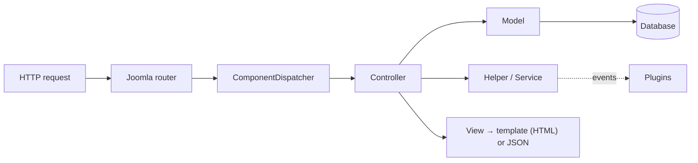

# Architecture Overview

Alfa Commerce is a Joomla 6/7 component made of **three applications** that share one database and one service layer:

| Application | Path | Does |
|-------------|------|------|
| **Site** | `site/` | The storefront — catalog, cart, checkout |
| **Administrator** | `administrator/` | Catalog, orders, settings, the bulk of the code |
| **API** | `api/` | A JSON-API ([Postman collection](/docs/api/overview)) |

Business logic lives in **helpers & services** (not controllers), prices are **immutable value objects**, and third
parties extend the system through **events** — never by editing core.

## The big picture



The three applications run the same Joomla MVC; controllers stay thin and delegate to the service layer; and at well
defined points the component **dispatches events** that plugins handle.

## Request flow



Same path for all three apps — the **API** simply ends in a JSON view instead of an HTML template, and the **admin**
adds Form XML + Table CRUD.

## Service layer

Controllers orchestrate; the real work is in helpers/services so it can be reused by the site, admin and API alike:

- **Cart & checkout** — `CartHelper`, `OrderPlaceHelper` (atomic, transactional order placement)
- **Orders** — [Order Helpers](../helpers/order-helpers.md) (items, totals, stock, statuses)
- **Pricing** — the [Pricing](../helpers/pricing.md) engine + `PriceIndexSyncService`

## Plugins & events

The component boots plugins by group and dispatches typed events to them; a plugin's capability is set by the **event
class** it receives (data → redirect → layout). See [Plugin Development](../plugins/overview.md). Groups: `alfa-payments`,
`alfa-shipments`, `alfa-form-fields`, `alfa-media`, plus the `webservices` and `system` plugins.

## Dependency injection

`administrator/services/provider.php` registers the component's factories and the component itself:

```php
$container->registerServiceProvider(new MVCFactory('\\Alfa\\Component\\Alfa'));
$container->registerServiceProvider(new ComponentDispatcherFactory('\\Alfa\\Component\\Alfa'));
$container->registerServiceProvider(new RouterFactory('\\Alfa\\Component\\Alfa'));

// Frontend language-switch associations (mod_languages / languagefilter)
$container->set(AssociationExtensionInterface::class, new AssociationsHelper());

// The component, wired with the registry, MVC factory, router and associations
$container->set(ComponentInterface::class, fn ($c) => (new AlfaComponent(
    $c->get(ComponentDispatcherFactoryInterface::class)
))->setRegistry(...)->setMVCFactory(...)->setRouterFactory(...)->setAssociationExtension(...));
```

## Patterns at a glance

| Pattern | Where |
|---------|-------|
| MVC | every controller / model / view |
| Service layer | `CartHelper`, `OrderPlaceHelper`, the order helpers, `PriceIndexSyncService` |
| Value objects (immutable) | `Money`, `Currency`, `PriceResult` |
| Fluent builders | `OrderPaymentHelper`, `OrderShipmentHelper`, `PriceSettings` |
| Strategy | `PricingIntent` (catalog / cart / checkout / quote) |
| Observer / events | the plugin system |
