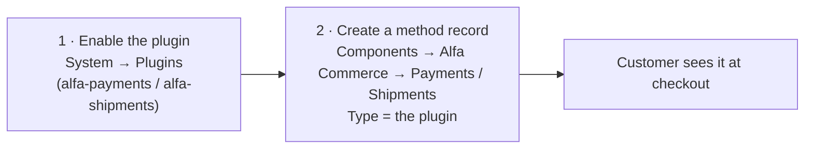

# Store Setup

The day-1 path for building a store. Everything below lives under **Components → Alfa Commerce** — each is a
list view with a New/Edit form.

## 1. Products (Items)

**Components → Alfa Commerce → Items → New.** An item is one product. Key fields: **Name** + **Default Category**
(required), `SKU` / `GTIN` / `MPN`, stock + dimensions, the **Stock action** (no action / notify / hide when out of
stock), categories, manufacturers, images, and meta.

**Pricing is a list, not a single field.** The **Prices** subform holds one or more rows; each row sets a price for a
combination of **currency · country/place · user group · user · quantity tier** (each defaults to *All*). Add one row
per combination; an *All …* row is the catch-all. Price rows feed the price index, rebuilt on save.

## 2. Payment & shipment methods — the key concept

There are **two layers**, and new users must understand the split:

1. **The plugin** does the work (the bundled `standard` plugin, or a gateway). It lives in the `alfa-payments` /
   `alfa-shipments` plugin group — enable it under **System → Plugins**.
2. **The method record** is what the customer picks at checkout (**Components → Alfa Commerce → Payments** or
   **Shipments → New**). Its **`Type`** field lists every *enabled* plugin in that group; the value you pick **is the
   plugin** that runs the method (default `standard`). The chosen plugin's own settings then appear inline on the form.

So: **enable the plugin first, then create a method record whose `Type` points at it.** Both forms scope the method by
category / manufacturer / place / user-group / user (each defaults to *All*), with a "show on product" toggle.

## 3. Currencies, taxes & discounts

- **Currencies** (→ Currencies): ISO `code`, `symbol`, ISO `number` (e.g. 978 = EUR), decimals, and a format pattern.
  The **default currency is a component Option**, not a flag on a record — set it at **Options → Currencies → Default
  currency** (by ISO number).
- **Taxes** (→ Taxes): `value` + a **Behavior** (only this / combined / one-after-another).
- **Discounts** (→ Discounts): amount-or-percentage, add/subtract, apply before/after tax, behavior, optional tag, dates.

Taxes and discounts are **scoped** the same way as methods — multi-select category / manufacturer / place / user-group /
user; leaving *All* makes the rule global.

## 4. Coupons

**Components → Alfa Commerce → Coupons → New.** Set `coupon_code`, number of uses, value type (% or amount), min/max,
optional user association, and validity dates. A coupon a customer applies is carried on the cart as `applied_coupons`
and written to the order's cart-rule rows at checkout (an after-tax discount — it isn't folded into item prices).

## 5. Order statuses & emails

**Components → Alfa Commerce → Order Statuses → New.** Each status has:

- an internal **Name** + the customer-facing **`name_customer`**, colors, and a **Stock operation** toggle
  (*remove from stock* vs *keep in stock*) applied when an order enters the status;
- **roles** — `is_initial` / `is_cancelled` / `is_completed` (mutually exclusive, one status each);
- **Customer email** — a *Notify customer* toggle + an **email layout** picker and per-language content positions;
- **Admin email** — **recipients** (a multi-select of Joomla users, stored in `#__alfa_orderstatus_recipients`) who
  are notified when an order transitions into the status.

Emails are sent on transition **into** a status; per-language subject/body live in the
`#__alfa_orders_statuses_<langtag>` tables (see [Multilingual & Translations](../architecture/multilingual.md)).
