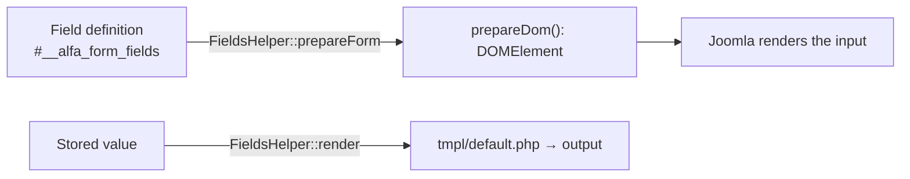

# Building Form Field Plugins

A form field plugin defines a new **field type** that admins can attach to Alfa records (checkout, cart, products,
users…) from the field-definition UI. It is a Joomla plugin in the **`alfa-fields`** group, and **one plugin = one type**
(plugin name == type name). Core ships four: `text`, `textarea`, `tel`, `choice`.

A field plugin does three things: **build the input** (`prepareDom`), **render the stored value** (a `tmpl/` layout), and
optionally **validate** it.



## Anatomy

```
plugins/alfa-fields/<type>/
├── <type>.xml                    # manifest — group="alfa-fields"
├── services/provider.php         # DI provider
├── src/Extension/<Type>.php       # extends FieldsPlugin
├── src/Field/<X>Field.php         # optional: custom JForm input widget
├── src/Rule/<X>Rule.php           # optional: server-side validation
├── params/params.xml             # the field's admin settings (incl. sql_type for the DB column)
├── tmpl/default.php              # display layout (renders the stored value)
└── language/en-GB/plg_alfa-fields_<type>.ini (+ .sys.ini)
```

- **Manifest:** `group="alfa-fields"` + `<namespace path="src">Joomla\Plugin\AlfaFields\<Type></namespace>`.
- **Class:** `final class <Type> extends \Alfa\Component\Alfa\Administrator\Plugin\FieldsPlugin`.
- **Provider:** instantiate from `PluginHelper::getPlugin('alfa-fields', '<type>')` and `setApplication()`; do **not** pass a
  dispatcher (deprecated). Follow the `tel`/`choice` providers.

:::note Type discovery — no `onGetTypes`
Types are found by **enumerating enabled `alfa-fields` plugins** (`AlfaHelper::getFieldTypes()`), not via an event. Enable
your plugin and it appears in the "Type" dropdown automatically; its `params/params.xml` becomes the field's settings form.
:::

## Building the input — `prepareDom()`

The one method that matters. It is **called directly** by `FieldsHelper` (not a dispatched event, so it is **not** in
`getSubscribedEvents()`). It appends a Joomla `<field>` DOM node to the form fieldset and returns it (or `null` to render nothing).

```php
use Alfa\Component\Alfa\Administrator\Event\Fields\PrepareDomEvent;
use Alfa\Component\Alfa\Administrator\Plugin\FieldsPlugin;
use DOMElement;

final class Color extends FieldsPlugin
{
    public function prepareDom(PrepareDomEvent $event): ?DOMElement
    {
        $node = parent::prepareDom($event);   // base builds the standard node (label, default, params→attrs, showon…)
        if ($node === null) {
            return null;
        }
        $node->setAttribute('type', 'color'); // turn it into your widget
        return $node;
    }
}
```

`PrepareDomEvent` gives you `getField()` (the definition record), `getFieldset()` (append here), and `getForm()`. The base
`prepareDom()` already handles the label/description/required/default, forwards params to attributes, collapses multilingual
maps to the current language, and emits the `showon*` attributes — so a minimal type (`text`/`textarea`) is an **empty
subclass**, and others just override and mutate the returned node.

> Custom widget? Ship `src/Field/<X>Field.php` and register it from `prepareDom()`:
> `FormHelper::addFieldPrefix('Joomla\\Plugin\\AlfaFields\\Color\\Field'); $node->setAttribute('type', 'mywidget');`

## Rendering the value — `tmpl/default.php`

`FieldsHelper::render()` resolves a layout and `extract()`s `$field`, `$fieldParams` (a `Registry`), `$item`, `$context`:

```php
<?php defined('_JEXEC') or die;
extract($displayData);
$value = (string) ($field->value ?? '');
if ($value === '') return;
echo htmlspecialchars($value, ENT_QUOTES | ENT_SUBSTITUTE, 'UTF-8');
```

## Validation

Two layers, both keyed off attributes you set in `prepareDom()`:

- **Client-side** uses the **`class="validate-<rule>"`** convention (the `validate="<rule>"` attribute alone is
  server-side only — set both), and the rule name must be **lowercase**.
- **Server-side** is a `FormRule` under `src/Rule/` registered via `FormHelper::addRulePrefix(...)`; it can also normalize
  the value back into the input (as `tel` does, writing the canonical E.164 number).

`ValidateFieldEvent` exists as a class but is **not dispatched** — use the Rule + `validate-X` path.

## Multilingual

Translatable values are stored as `{lang: value}` maps and collapsed to the current language by the engine, so your
`prepareDom()` and layout always see plain strings — you don't handle translations.

## Conditional visibility (showon)

Show or hide a field based on the live values of *other* fields. The base `prepareDom()` emits `showonname` /
`showontype` / `showonrule` attributes that the runtime engine (`media/js/site/cart/showon.js`) reads to toggle
visibility — hidden fields are also disabled so `required` can't block submit.

- **Authoring** — each field has a **ShowOn** tab (a visual builder): pick a switch field, an operator, and a value;
  join rules with an **AND / OR** glue; nest groups for precedence. The builder stores canonical JSON in `params->showon`.
- **Rule schema** — `{ "group": [ { "rule": { "field": "delivery_method", "op": "=", "values": ["courier"] }, "glue": "OR" }, … ] }` — evaluated left-to-right (no precedence; nest a group), **one value per rule**, empty = always shown.
- **Operators** — `=` `!=` · `contains` · `startsWith`/`endsWith` · `regex` · `empty` · `>` `>=` `<` `<=` · `between` · `length` (each `!`-negatable).
- **Custom widgets** register a value reader (load-order independent):
  ```js
  (window.alfaShowOn = window.alfaShowOn || []).push({ type: 'choice', value: (name, form) => currentValue });
  ```
  A widget that changes a value without firing native events should dispatch a bubbling `alfa:field-change`.

**Gotchas:** one value per rule (use multiple OR-joined rules), no precedence (nest groups), a field can't gate on
itself, and hidden ≠ removed (the input is disabled, so it submits nothing server-side).

## Minimal example

A `color` type: the manifest (`group="alfa-fields"`, namespace `…\Color`), a `services/provider.php`, the `Color` class
above, a `params/params.xml` with `<field name="sql_type" type="hidden" default="varchar(7)"/>`, a `tmpl/default.php`, and
the language files. Enable it — `color` appears as a new field type. Add `src/Rule/ColorRule.php` + `validate-color` only if
you need validation, and `media/` + an `onBeforeCompileHead` subscriber only if you need CSS/JS.
