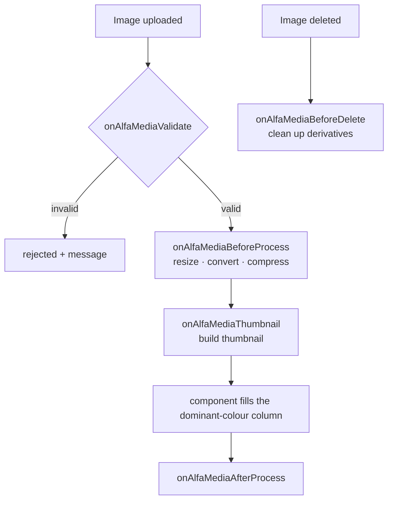

# Building Media Plugins

A media plugin is a Joomla plugin in the **`alfa-media`** group. It hooks the component's image pipeline to
**validate**, **optimise** (resize / convert / compress), **thumbnail**, and **clean up** uploaded images.

:::note Division of responsibility
The **component owns** storage, the always-filled **dominant-colour** column, and a baseline thumbnail. A media plugin
owns the **actual processing** — there is *no* core default, so without an `alfa-media` plugin images are stored as-is.
No media plugin ships in the core package; image processing is added by a separately-installed `alfa-media` plugin
(which you build as shown below).
:::

Unlike payment/shipment/field plugins, media plugins have **no base class** — they extend `CMSPlugin` and implement
`SubscriberInterface`, wiring the hooks through `getSubscribedEvents()`.

## Pipeline



## Hooks

All five are dispatched events (`MediaHelper` imports `alfa-media` plugins and fires them). Every event carries
`getSource()`, `getDest()`, `getOrigin()`, `getField()`.

| Event | Class | You can… | Key API |
|-------|-------|----------|---------|
| `onAlfaMediaValidate` | `ValidateEvent` | **veto** a file | `getAllowedMimes()`; `setValid(false)` + `setError(...)` |
| `onAlfaMediaBeforeProcess` | `BeforeProcessEvent` | optimise the master image | `getFormat()` `getMaxWidth()` `getMaxHeight()` `getQuality()`; `setFinalPath(...)` + `setProcessed(true)` |
| `onAlfaMediaThumbnail` | `ThumbnailEvent` | build a thumbnail | same API as BeforeProcess |
| `onAlfaMediaAfterProcess` | `AfterProcessEvent` | post-process | `getColor()` (component-filled dominant colour), `isProcessed()` |
| `onAlfaMediaBeforeDelete` | `BeforeDeleteEvent` | clean up derivatives | `getRows()`, `getPaths()` |

## Anatomy

```
plugins/alfa-media/<name>/
├── <name>.xml                    # manifest — group="alfa-media"
├── services/provider.php         # DI provider
├── src/Extension/<Name>.php       # extends CMSPlugin implements SubscriberInterface
└── language/en-GB/plg_alfa-media_<name>.ini (+ .sys.ini)
```

- **Manifest:** `group="alfa-media"` + `<namespace path="src">Joomla\Plugin\AlfaMedia\<Name></namespace>`.
- **Per-context params:** optimisers typically expose a `contexts` subform in `params` so behaviour (max size, format,
  quality) differs per image context (catalog, category, …) — read via `$this->params->get('contexts', [])`.

## Minimal example

```php
namespace Joomla\Plugin\AlfaMedia\YourMediaPlugin\Extension;

use Alfa\Component\Alfa\Administrator\Event\Media\ValidateEvent;
use Alfa\Component\Alfa\Administrator\Event\Media\BeforeProcessEvent;
use Joomla\CMS\Plugin\CMSPlugin;
use Joomla\Event\SubscriberInterface;

defined('_JEXEC') or die;

final class YourMediaPlugin extends CMSPlugin implements SubscriberInterface
{
    public static function getSubscribedEvents(): array
    {
        return [
            'onAlfaMediaValidate'      => 'onAlfaMediaValidate',
            'onAlfaMediaBeforeProcess' => 'onAlfaMediaBeforeProcess',
            'onAlfaMediaThumbnail'     => 'onAlfaMediaThumbnail',
            'onAlfaMediaAfterProcess'  => 'onAlfaMediaAfterProcess',
            'onAlfaMediaBeforeDelete'  => 'onAlfaMediaBeforeDelete',
        ];
    }

    public function onAlfaMediaValidate(ValidateEvent $event): void
    {
        if (!in_array(mime_content_type($event->getSource()), $event->getAllowedMimes(), true)) {
            $event->setValid(false);
            $event->setError('Unsupported image type.');
        }
    }

    public function onAlfaMediaBeforeProcess(BeforeProcessEvent $event): void
    {
        $out = $this->resize(
            $event->getSource(), $event->getDest(),
            $event->getMaxWidth(), $event->getMaxHeight(),
            $event->getFormat(),  $event->getQuality(),
        );
        $event->setFinalPath($out);
        $event->setProcessed(true);
    }

    public function onAlfaMediaThumbnail(BeforeProcessEvent $event): void { /* same shape, smaller bounds */ }
    public function onAlfaMediaAfterProcess($event): void { /* e.g. log; $event->getColor() is set by the component */ }
    public function onAlfaMediaBeforeDelete($event): void { /* remove your derivatives for $event->getPaths() */ }
}
```
