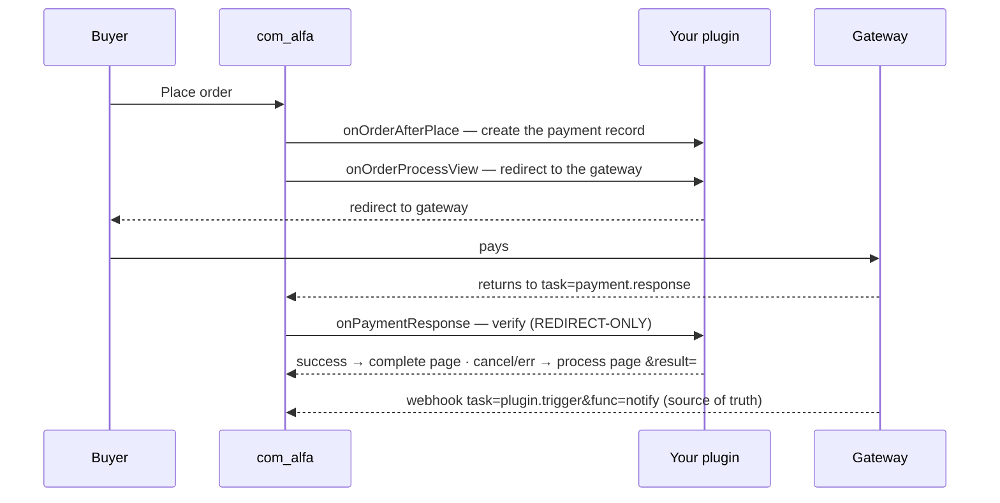

# Building Payment Plugins

A payment plugin is a Joomla plugin in the **`alfa-payments`** group. The component boots it with
`bootPlugin($type, 'alfa-payments')` and calls your hooks across the storefront, checkout, the gateway
return, and the admin order screen.

:::tip Start from `standard`
The bundled **`plg_alfapayments_standard`** plugin (offline: bank transfer / cash on delivery) is the
heavily-documented reference — copy it as your skeleton. Being offline, it has **no** `onPaymentResponse`.
Real gateways (Revolut, Viva, …) are premium and distributed separately — they are not in the core package.
:::

## Lifecycle



## Anatomy

```
plugins/alfa-payments/<gateway>/
├── <gateway>.xml                  # manifest — group="alfa-payments"
├── services/provider.php          # DI: boots the plugin from PluginHelper::getPlugin()
├── src/Extension/<Gateway>.php     # extends PaymentsPlugin
├── params/{params.xml, logs.xml}  # admin config + plugin log-table schema
├── tmpl/                          # layout fragments (default_item_view.php, …)
└── language/en-GB/plg_alfa-payments_<gateway>.ini (+ .sys.ini)
```

- **Manifest:** `group="alfa-payments"` (mandatory) and `<namespace path="src">Joomla\Plugin\AlfaPayments\<Gateway></namespace>`.
- **Class:** `final class <Gateway> extends \Alfa\Component\Alfa\Administrator\Plugin\PaymentsPlugin`.
- **Provider:** copy the standard `services/provider.php` and swap the class import + the `getPlugin('alfa-payments', '<gateway>')` strings.

## Hooks by capability tier

Capability is enforced by the **event class** each hook receives (`GeneralEvent` → `RedirectEvent` → `LayoutEvent`).
A data-tier event has no `setLayout()` / `setRedirectUrl()` at all.

| Tier | Hooks | Render layout? | Redirect? |
|------|-------|:--:|:--:|
| **View** | `onItemView`, `onCartView`, `onOrderProcessView`, `onOrderCompleteView` | ✅ | ✅ |
| **Data** | `onOrderBeforePlace`, `onOrderAfterPlace` | ❌ | ❌ |
| **Gateway return** | `onPaymentResponse` | ❌ | ✅ (redirect-only) |
| **Admin** | `onGetActions`, `onExecuteAction` | ✅ (modal) | ✅ |

Each view hook carries `$event->getMethod()` (the payment-method record) + a subject (`getItem()`/`getCart()`/`getOrder()`).
`onItemView`/`onCartView` are abstract on the base `Plugin`; `onOrderProcessView`/`onOrderCompleteView` are abstract on
`PaymentsPlugin` — implement all four (an empty `setLayout` is fine).

## The gateway-return flow

The part most integrations get wrong — there are **three distinct entry points**, keep them separate:

1. **`onOrderProcessView`** (has a view) — sends the buyer to the gateway with `$event->setRedirectUrl($gatewayUrl)`.
   On the buyer's *return* it also **renders the result layout** by reading a `?<plugin>_result=` flag.
2. **`onPaymentResponse`** (`PaymentController::response()`, **no view**) — verify the return and **redirect only**:
   ```php
   public function onPaymentResponse($event): void
   {
       $order = $event->getOrder();
       if ($paid) {
           $this->payment($order)->completed()->transactionId($txn)->save();
           $event->setRedirectUrl($this->getCompletePageUrl());                  // success → complete page
           return;
       }
       $event->setRedirectUrl($this->getProcessPageUrl() . '&mygw_result=cancelled'); // cancel/err → process page
   }
   ```
   **Never `setLayout()` here** — `PaymentResponseEvent` is redirect-only and the controller has no view, so a layout is
   silently dropped. To *show* a page, redirect to a view page (the process page) and let `onOrderProcessView` render it.
3. **Webhook** — `task=plugin.trigger&type=alfa-payments&name=<plugin>&func=notify` runs with no session/view and is the
   **source of truth** for payment confirmation. Treat the browser return as UX only.

`getCompletePageUrl()` / `getProcessPageUrl()` come from `PaymentsPlugin` (raw internal URLs are auto-SEF-routed).

## The payment record

`PaymentsPlugin` exposes a fluent builder (an `OrderPaymentHelper`):

```php
$this->payment($order)->pending()->save();                 // create (amount auto-resolved from the order)
$this->paymentUpdate($id)->completed()->transactionId($t)->processedAt($now)->save();  // capture / mark paid
```

Status setters: `pending()` `authorized()` `completed()` `failed()` `cancelled()` `refunded()`. `save()` writes only the
changed columns and records the change to the order activity log automatically. A **refund** is two steps: flip the
original `->refunded()`, then create a `->refund()->refundedPayment($id)->fullRefund()` audit record. Full API:
[Order Payment Helper](../helpers/order-payment-helper.md).

## Minimal example (online gateway)

```php
namespace Joomla\Plugin\AlfaPayments\YourGateway\Extension;

use Alfa\Component\Alfa\Administrator\Plugin\PaymentsPlugin;
use Joomla\CMS\Factory;

defined('_JEXEC') or die;

final class YourGateway extends PaymentsPlugin
{
    public function onItemView($event): void  { $event->setLayout('default_item_view'); $event->setLayoutData(['method' => $event->getMethod(), 'item' => $event->getSubject()]); }
    public function onCartView($event): void  { $event->setLayout('default_cart_view'); $event->setLayoutData(['method' => $event->getMethod(), 'item' => $event->getSubject()]); }
    public function onOrderCompleteView($event): void { $event->setLayout('default_order_completed'); $event->setLayoutData(['order' => $event->getOrder(), 'method' => $event->getMethod()]); }

    public function onOrderProcessView($event): void
    {
        $result = Factory::getApplication()->getInput()->getString('yourgateway_result', '');
        if ($result === '') {                                   // first arrival → go pay
            $event->setRedirectUrl($this->buildGatewayUrl($event->getOrder()));
            return;
        }
        $event->setLayout('default_order_process_' . $result);  // came back → render result
        $event->setLayoutData(['order' => $event->getOrder()]);
    }

    public function onOrderAfterPlace($event): void             // DATA: create the record
    {
        $order = $event->getOrder();
        if ($order && !empty($order->id)) {
            $this->payment($order)->authorized()->save();       // offline standard uses ->pending()
        }
    }

    public function onPaymentResponse($event): void             // REDIRECT-ONLY
    {
        $order = $event->getOrder();
        if ($this->confirmedAtGateway($order)) {
            $this->payment($order)->completed()->transactionId($txn)->save();
            $event->setRedirectUrl($this->getCompletePageUrl());
            return;
        }
        $event->setRedirectUrl($this->getProcessPageUrl() . '&yourgateway_result=cancelled');
    }
}
```

> Admin buttons: implement `onGetActions` (register with `$event->add('id', 'Label')->icon('truck')->css('btn-success')->confirm('…')`)
> and `onExecuteAction` (route by `$event->getAction()`, respond with `setMessage()`/`setError()`/`setRefresh(true)`).

See [Event System](../architecture/event-system.md) for the full tier model.
