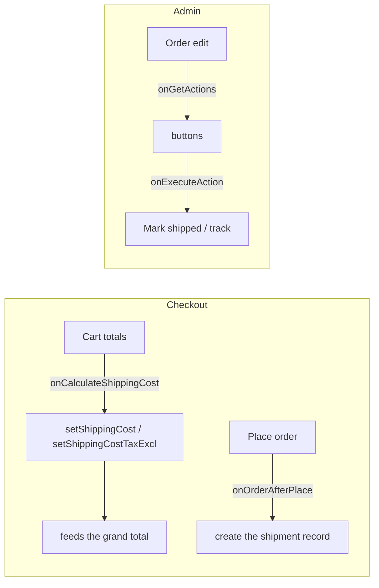

# Building Shipment Plugins

A shipment plugin is a Joomla plugin in the **`alfa-shipments`** group. It computes the shipping cost, creates the
shipment record on order placement, and adds buttons to the admin order screen.

:::tip Start from `standard`
The bundled **`plg_alfashipments_standard`** plugin (flat / zone rates) is the reference — copy it. Carrier
integrations (couriers, locker networks, flat-rate carriers, …) are premium and distributed separately; only `standard` ships in core.
:::

## Where it plugs in



## Anatomy

```
plugins/alfa-shipments/<carrier>/
├── <carrier>.xml                  # manifest — group="alfa-shipments"
├── services/provider.php          # DI: boots the plugin from PluginHelper::getPlugin()
├── src/Extension/<Carrier>.php     # extends ShipmentsPlugin
├── params/{shipment.xml, logs.xml}# method config (zones / API creds) + log-table schema
├── tmpl/                          # layout fragments
└── language/en-GB/plg_alfa-shipments_<carrier>.ini (+ .sys.ini)
```

- **Manifest:** `group="alfa-shipments"` and `<namespace path="src">Joomla\Plugin\AlfaShipments\<Carrier></namespace>`.
- **Class:** `final class <Carrier> extends \Alfa\Component\Alfa\Administrator\Plugin\ShipmentsPlugin`.

## Hooks by capability tier

| Tier | Hooks | Render layout? | Redirect? |
|------|-------|:--:|:--:|
| **View** | `onItemView`, `onCartView` | ✅ | ✅ |
| **Data** | `onCalculateShippingCost`, `onOrderBeforePlace`, `onOrderAfterPlace` | ❌ | ❌ |
| **Admin** | `onGetActions`, `onExecuteAction` | ✅ (modal) | — |

`onItemView`/`onCartView` (abstract on `Plugin`) and `onCalculateShippingCost` (abstract on `ShipmentsPlugin`) are
**required**; the rest are optional (dispatched only if the method exists).

:::note Admin hook names
The dispatched hook names are the short `onGetActions` / `onExecuteAction` (the *event classes* are
`GetShipmentActionsEvent` / `ExecuteShipmentActionEvent`). The `onAdminOrderShipmentView` /
`onAdminOrderShipmentPrepareForm` event classes exist but their dispatch is currently **not wired** — don't rely on them.
:::

## Shipping cost

`CartHelper::computeShipmentCosts()` dispatches `onCalculateShippingCost` **once per request** (the result is cached) and
reads two floats back off the event:

```php
public function onCalculateShippingCost($event): void
{
    $cart   = $event->getCart();    // CartHelper instance — $cart->getData() for cart data
    $method = $event->getMethod();  // method record; $method->params is the decoded config

    $cost = $this->computeCost($cart, $method);   // your logic / live rate API
    $event->setShippingCost($cost);               // REQUIRED — tax-inclusive
    $event->setShippingCostTaxExcl($cost);        // optional; defaults to the incl value
}
```

Those values flow straight into `getGrandTotal()` / `getGrandTotalExcl()`.

## Creating the shipment record

Done in `onOrderAfterPlace`. By then `OrderPlaceHelper` has already stamped `$order->total_shipping_tax_incl/excl`
(Money objects) — **read them, don't recompute**. Use the fluent builder (an `OrderShipmentHelper`):

```php
public function onOrderAfterPlace($event): void
{
    $order = $event->getOrder();
    if (!$order || empty($order->id)) {
        return;
    }
    $incl = is_object($order->total_shipping_tax_incl ?? null) ? $order->total_shipping_tax_incl->getAmount() : 0.0;
    $excl = is_object($order->total_shipping_tax_excl ?? null) ? $order->total_shipping_tax_excl->getAmount() : 0.0;

    $this->shipment($order)->pending()->withAllItems()->cost($incl, $excl)->save();
}
```

Builder (`$this->shipment($order)` create · `$this->shipmentUpdate($id)` update): status `pending()` `shipped()`
`delivered()` `cancelled()` `onHold()` `returned()`; items `withAllItems()` / `withItems([ids])` / `withNoItems()`;
`cost($incl, $excl)`; `trackingNumber($n)` / `trackingUrl($u)`; `save() → int|false`. `shipped()` stamps the shipped date;
`delivered()` stamps both. It auto-fills weight, method-name snapshot, currency, and writes an activity-log entry.

## Admin buttons

```php
public function onGetActions($event): void
{
    if (($event->getShipment()->status ?? 'pending') === 'pending') {
        $event->add('mark_shipped', Text::_('PLG_ALFA_SHIPMENTS_FLATRATE_MARK_SHIPPED'))
              ->icon('truck')->css('btn-success')->priority(200);
    }
}

public function onExecuteAction($event): void
{
    match ($event->getAction()) {
        'mark_shipped' => $this->markShipped($event),   // $this->shipmentUpdate($id)->shipped()->save();
        default        => $event->setError('Unknown action: ' . $event->getAction()),
    };
    // respond via $event->setMessage() / setError() / setRefresh(true); or a modal via setLayout()+setModalTitle()
}
```

See [Order Shipment Helper](../helpers/order-shipment-helper.md).
