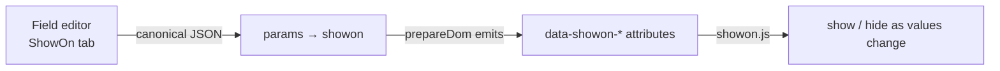

# Conditional Field Visibility (showon)

Alfa Commerce ships its own **ShowOn** engine to show/hide custom form fields based on the live values of *other* fields
on the same form — e.g. show an *Address* field only when *Delivery method* is `courier`. It runs primarily on the
checkout/cart form, where fields come from the `#__alfa_form_fields` definitions.



## Why a custom engine

Joomla's native `showon` targets plain, statically-named inputs. Alfa fields are **plugin-rendered widgets** with opaque
input names and richer needs (many operators, nested AND/OR groups). Alfa uses **namespaced `data-showon-*` attributes**, so
its engine and Joomla core's never collide.

## Using it

You rarely hand-write the rule. Each Alfa field has a **ShowOn tab** in its editor (a visual builder): pick a *switch
field*, an *operator*, and a *value*; add more rules joined by an **AND / OR** glue; nest **groups** for precedence. The
builder serialises the tree into the field's `params->showon`.

### Rule schema

```json
{ "group": [
    { "rule": { "field": "delivery_method", "op": "=", "values": ["courier"] }, "glue": "OR" },
    { "rule": { "field": "delivery_method", "op": "=", "values": ["express"] }, "glue": "AND" },
    { "rule": { "field": "country", "op": "!=", "values": ["GR"] } }
] }
```

- An item is a `rule` **or** a nested `group`, plus a `glue` (`"AND"` default / `"OR"`) joining it to the **next** sibling; the **last** item has no glue.
- Evaluation is **strict left-to-right — no operator precedence**. Use a nested `group` to control grouping.
- **Single value per rule** (`values[0]`). OR is the glue *between rules*, never a value delimiter — values are never comma-split. (`between` uses `values[0]`/`values[1]`.)
- An empty rule (`""`) means **always shown**.

### Operators

`=` `!=` · `contains` `!contains` · `startsWith` `endsWith` · `regex` `!regex` · `empty` `!empty` · `>` `>=` `<` `<=` ·
`between` · `length` / `!length`. Any `!`-prefixed form is auto-negated by the engine. Add your own at runtime with
`Alfa.ShowOn.setOperator(name, fn)`.

## How the engine works

`FieldsPlugin::prepareDom()` emits three attributes per field — `showonname` (the field name, so any field can be a
switch), `showontype` (selects the value reader), and `showonrule` (the JSON, on target fields only). The
`grouped_fields.php` layout wraps each field in `<div data-showon-name … data-showon-type … data-showon-rule='…'>`. The
runtime engine (`media/js/site/cart/showon.js`, asset `com_alfa.showon`) then:

1. indexes every `[data-showon-name]` once per form;
2. reads each switch value (a per-type provider if registered, else a native reader);
3. **memoises** each switch within one evaluation pass (O(distinct switches), not O(rules));
4. evaluates the rule tree recursively and toggles `hidden`/`aria-hidden`, **disabling** hidden inputs so `required` can't
   block submit; a fieldset whose ShowOn fields are all hidden hides too.

### Custom widgets — register a value reader (one line)

If your field type renders a non-native widget, tell the engine how to read its value — load-order-independent:

```js
(window.alfaShowOn = window.alfaShowOn || []).push({
    type: 'choice',
    value: function (name, form) { return currentValueOrArray; }
});
```

`window.alfaShowOn` starts as a queue; the engine drains it on init, then turns it into a live sink whose `push` also
triggers a repaint. The only stable contract is the `{type, value}` shape. A widget that changes a value *without* firing
native events should dispatch a bubbling **`alfa:field-change`** event (the engine's escape hatch). Native `input`/`change`
are coalesced into one pass via a macrotask, so a single gesture evaluates once.

## Gotchas

- **Single value per rule** — for multiple options, add multiple rules joined with `OR`.
- **No precedence** — left-to-right; nest groups to group.
- **A field can't gate on itself** (excluded from the switch list).
- **Hidden ≠ removed** — hidden inputs are disabled, so server-side a hidden field submits nothing; design validation accordingly.
- **Custom widgets need a value provider**, or the default native reader may read the wrong thing.

## Example

Show *Address* only when *Delivery method* = `courier`: open the Address field's **ShowOn** tab → one rule
(*Delivery method* `is` `courier`) → save. Choosing *pickup* hides + disables Address; choosing *courier* shows it instantly.

See [Building Form Field Plugins](./custom-field-plugins.md).
